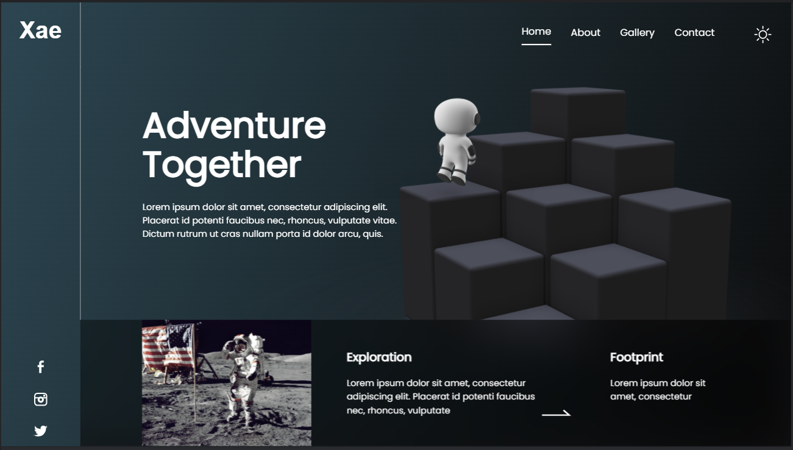

#### [Design link](https://www.figma.com/file/hDcipE9zMuiDsYAkjcQuKw/Space?node-id=0%3A1)

#### [Hosted Link](https://wonderful-ptolemy-454e34.netlify.app/)

## UI Created:

#### Screenshot taken in this resolution `(1600x900)`

## clone the repo and run the following commands, to run in your local

#### `npm intall`

#### `npm start`
